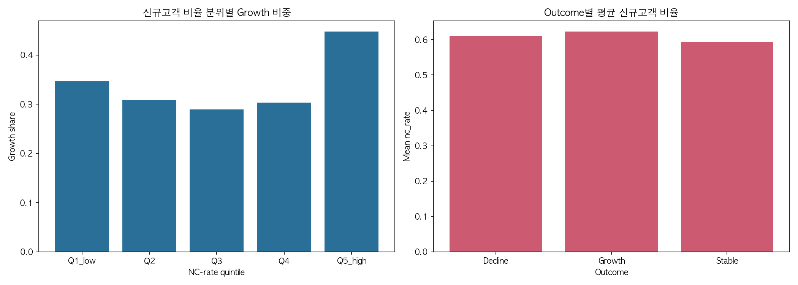
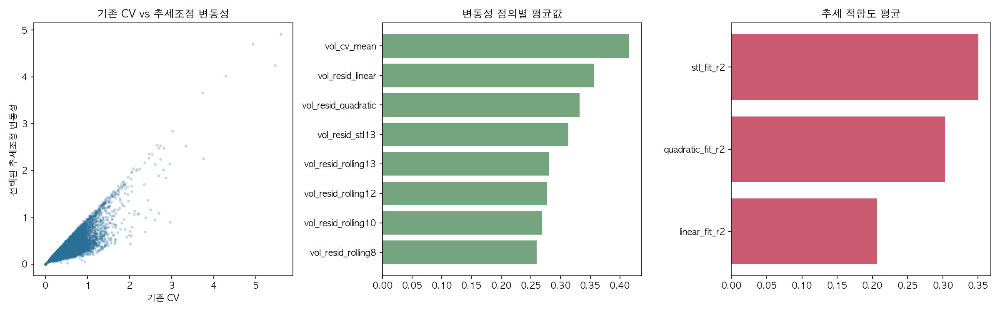

# 학위논문 Main Result 및 Main Figure 가이드라인

본 문서는 기존 작성된 `KCD_FINAL.pdf` (논문 드래프트)와 **25-1학기 / 26-1학기 개별 미팅 자료**, 그리고 가장 최신의 분석 디렉토리(`/260*`)들을 종합적으로 검토하여 도출된 최종 학위논문의 핵심 논지(Main Result)와 시각화 자료(Main Figure)를 정리한 것입니다.

최근의 미팅 기록 및 분석 파이프라인에서 발견된 혁신적인 내용(골든크로스 현상, 하이브리드 변동성 등)을 앞세워 연구의 학술적/실무적 가치를 극대화하는 것을 목적으로 합니다.

---

## 1. Main Result (주요 연구결과) 제안

단순 클러스터링 및 기계 학습 모델링 위주였던 기존 드래프트에서 나아가, **소상공인 생애주기의 변곡점(Inflection Point)**과 이를 주도하는 **핵심 선행 지표(고객 유입, 변동성)**에 집중하여 아래 3가지 결과를 메인으로 배치할 것을 제안합니다.

### Result 1. 하이브리드 클러스터링(Hybrid Clustering)을 통한 생애주기 State 정의
- **핵심 내용:** 매출 추세만 보는 전통적인 클러스터링(K-Means, DTW 등) 방법의 한계를 지적하고, K-Shape에 **Change Point Detection (변곡점 정보)**를 결합하는 하이브리드 클러스터링을 제안합니다. 이를 통해 소상공인 매출의 불규칙한 원시 데이터를 유의미한 '생애주기 상태(State; 예: DUY 상향반등, DDZ 지속쇠퇴)'로 요약했습니다.
- **의의:** 설명이 어려운 경제 Data를 해석 가능한 체계적인 상태로 구체화하여, 이후 기계 학습 모델이 본연의 의미를 포착할 수 있게 돕는다는 점을 강조합니다.

### Result 2. 매출 반등을 이끄는 선행 지표 발굴: 신규 고객 유입률의 "골든 크로스"
- **핵심 내용:** 지속적인 궤도에 오르기 전 반등하는 업장(DUY)은 매출 변곡점(t=0)이 오기 약 3~4주 전(t=-4)부터 **신규 고객 유입률(New Customer Ratio)이 약 5배 가량 급등**하며 다른 약세 집단(DDZ)을 추월하는 뚜렷한 현상을 보입니다.
- **의의:** 신규 고객의 유입이 단순히 성장의 결과로 나타나는 것이 아니라 성장을 주도하는 명확한 **선행 지표(Leading Indicator)**임을 입증한 대목입니다.

### Result 3. 안정성보다 필수적인 "매출 변동성"과 생애주기 초기 예측
- **핵심 내용:** 흔히 경영 초기에 매출 곡선이 안정적인 것이 좋다고 믿지만, 초기 성장하는 업장(Growth 집단)은 오히려 12-week moving average 기반 **높은 수준의 매출 변동성(Volatility)**을 수반한다는 점을 증명했습니다. 초기의 역동성과 클러스터 구조적 특징을 30주 데이터로 예측 파이프라인(XGBoost)에 주입하자 장기 성장 구분 성능(F1 Score)이 0.68에서 0.84로 대폭 상승했습니다.
- **의의:** 높은 초기 변동성이 성공적인 성장 궤도로 향하기 위한 필수적 진통이라는 비직관적 현상을 학술적으로 규명하였으며 조기 예측의 실무적 적용 능력을 입증합니다.

---

## 2. Main Figure (메인 시각화 자료) 매핑

위의 Main Result들을 직관적으로 입증하기 위한 최신 연구 데이터 시각화 결과물입니다.

### Figure 1. 신규 고객 유입률과 골든 크로스 
- **위치:** `figures/new_customer_overview.png`
- **적용:** Result 2 파트
- **활용:** 성장이 시작되기 약 4주 전, 신규 고객 유입 지표가 급격하게 상승해 쇠퇴 집단을 교차하는 '골든 크로스' 순간을 강력하게 보여줍니다.

### Figure 2. 생애주기별 초기 매출 변동성 차이 
- **위치:** `figures/volatility_comparison.png`
- **적용:** Result 3 파트
- **활용:** Stable/Decline 집단에 비해 Growth 집단이 초기에 높은 변동성을 겪는 분산 데이터 및 형태를 보여주며, Growth로 가기 위해 변동성이 불가피함을 보여줍니다.

---

## 결론
단순 기계적 예측(Prediction)에 그치는 것이 아니라, 
1) **하이브리드 생애주기 구분(K-shape + Change Point)**
2) **예측 선행지표로서의 골든 크로스 구조**
3) **단기 변동성(Volatility) 기반 성장 모델링**
위 3가지 논리를 연결하여 최종 학위 논문의 스토리보드로 삼으시기를 강력하게 권장합니다.
